[](https://github.com/TheDeepestSpace/aoc-2025/actions/workflows/ci.yaml)

## Advent of Code 2025 -- Day 10 solution

This repo contains SystemVerilog implementation for [Day 10 of Advent of Code
2025](https://adventofcode.com/2025/day/10). It is implemented as an acceperator, with structured
input fed from a controller. High-level architecture is as follows:

```mermaid
flowchart TB
  subgraph Day 10
    subgraph Controller
      python-script[Python script 🐍]
    end
    subgraph accelerator[Accelerator 🏎️]
      subgraph top-level[Top level]
        input-reader[Input reader 👓]
        subgraph configure-machine[Configure machine]
          compute-rref[Compute RREF 🔢]
          enumerate-solutions[Enumerate solutions 📋]

          compute-rref -- RREF data --> enumerate-solutions
        end
        output-writer[Output writer ✍️]

        input-reader -- structured input --> configure-machine
        configure-machine -- structured output --> output-writer
      end
    end

    python-script -- AXI stream --> top-level
    top-level -- AXI stream --> python-script
  end
```



The crux of the problem is representing the input buttons as an augmented matrix of binary elements
with columns being "buttons" (or, rather, thier effect on the lights of the machine), RHS being the
target arrangement of the lights. The augmented matrix is a
[GF(2)](https://en.wikipedia.org/wiki/GF(2)) matrix, i.e. the elements are either zeros or ones and
the add operation is represented by XOR. The augmented matrix is converted to its RREF
representation in [`gf2_rref`](src/gf2_rref.sv) module, then
[`enumerate_solutions`](src/enumerate_solutions.sv) takes over to build up the null bases over free
variables and iterates over the possible solutions.
[`configure_machine`](src/configure_machine.sv) module orchestrates
these two modules and tracks the solution involving minimum number of button presses.

On the top level, [`day10`](src/day10.sv) module deals with parsing the AXI input from the
[controller](controller/controller.py) into structured data via [`day10_input_reader`](src/day10_input_reader.sv), which is then
passed to [`configure_machine`](src/configure_machine.sv), and then structured output data is
converted into output AXI stream in [`day10_output_writer`](src/day10_output_writer.sv) to be sent
back to the [controller](controller/controller.py).

### Testing

Major modules [`gf2_rref`](src/gf2_rref.sv), [`enumerate_solutions`](src/enumerate_solutions.sv) and
[`configure_machine`](src/configure_machine.sv) have a couple of reality-check tests in thier
corresponding folder in [`tests/`](tests). There is also a single integration test that hooks up the
controller to the accelerator via [Cocotb's AXI
extension](https://github.com/alexforencich/cocotbext-axi) to confirm the overall operation of the
system.

Running the tests:
```bash
$ make test # for unit tests
$ make test_integration
```

Example output from the integration
test<sup>[1](https://github.com/TheDeepestSpace/aoc-2025/actions/runs/20932831897/job/60147862576#step:6:100)</sup>:
```
[machine 1] expected:
[machine 1] [.##.]
[machine 1] configuring: (in 2 button presses)
[machine 1] [....]
[machine 1] [.#.#]
[machine 1] [.##.]
[machine 1] done configuring
[machine 1] lights match target arrangement: True
[machine 2] expected:
[machine 2] [...#.]
[machine 2] configuring: (in 3 button presses)
[machine 2] [.....]
[machine 2] [#...#]
...
```

### Scaling

The deisgn's scale is configurable via `MAX_NUM_LIGHTS` and `MAX_NUM_BUTTONS` at instantiation of
the top level module [`day10`](src/day10.sv). This allows to configure the design for various input
data sizes. Current limits are upper bound of an 8-bit number, since this is max that current
[I/O](#io) setup can handle, but can be extended to support larger numbers.

### I/O

To avoid ASCII-level parsing on the RTL front, a basic binary protocol was designed to send the
parsed data to the accelerator. For each input controller sends:
* 8-bit unsigned number of lights for a given machine
* `N` bits corresponding to the target lights arrangement for the machine, where `N` corresponds to
  the number of lights; `ceil`d to next 8-bit boundary
* 8-bit unsigned number for buttons for a given machine
* `M*N` bits corresponding to a list of button's affects on the machine's lights, where `M`
  corresponds to the number of buttons; each button's data is `ceil`d to next 8-bit boundary

On the receiving side, the controller receives:
* 8-bit unsigned number representing minimum number of buttons to press for a given machine
* `M` bit corresponding to the mask of buttons that need to be pressed in order to achive the target
  arrangement, where `M` corresponds to the number of buttons for that machine (since processing is
  currently sequential, the controller knows that the machine it last sent the data of is the one
  its reading the data for); this data is used to display an ASCII representation of the
  configuration process for each machine

### Hardening

To confirm that the design is synthesizable, it has ben hardened for ASIC tape-out via Tiny
Tapeout's template repository and is available in this downstream repo:
https://github.com/TheDeepestSpace/aoc-2025-ttsky.

### Methodology

For this project I decided to try following [SVLint](https://github.com/dalance/svlint)'s approach
to writing SystemVerilog, which entails a lot restrictions when using combinational and sequential
logic. For instance, avoiding `begin` and `end` keywords within `always_comb` blocks to limit
potential for inferred latches, and being more explicit with `if` statements. Generally I feel like
it made me pay more attention to the design process as well as how my code is interpreted by both
other people and machines.

### Development

This repository contains a [devcontainer](https://containers.dev) [setup](.devcontainer) that
includes all the necessary tools needed for development and testing, with specific setup for VScode.

### Future improvements

The design is pretty light on optimizations, and lacks thorough testing of edge cases, so in the
future I would like to pipeline and paralellize the processing (e.g. keep deriving RREFs from
augmented input matrices while enumerating solutions) and finish testing the edge-cases.
